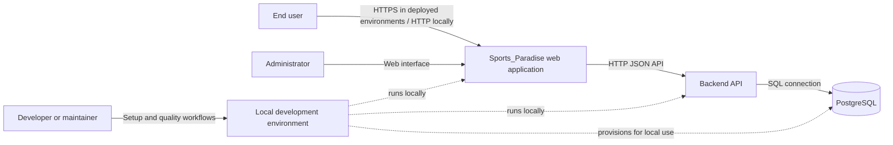
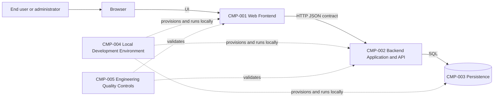
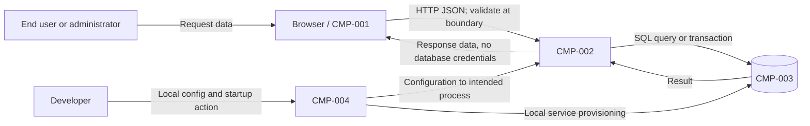
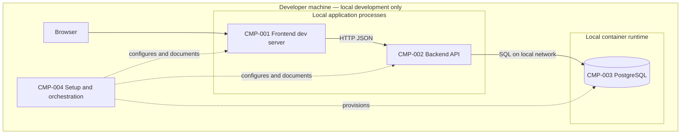

# Architecture Specification

## 1. Metadata

- Project Name: Sports_Paradise
- Project Mode: NEW_PROJECT
- Requirements Baseline: `docs/sdlc/requirements.md` (Story SP-1)
- Requirements Status: APPROVED
- Architecture Status: DESIGN_REVIEW_APPROVED
- Architecture Version: 1.1

## 2. Executive Architecture Summary

Sports_Paradise is a greenfield, local-development web application foundation.
The recommended design separates a browser-based frontend, a backend HTTP API,
and persistent relational storage. A single repository and a repeatable local
development environment keep contributor setup and coordinated changes simple
while preserving the frontend/backend/data boundaries required by BR-001.
Shared conventions and automated validation provide the quality baseline
before feature development scales.

The selected stack is React with TypeScript and Vite, Node.js with TypeScript
and Fastify, PostgreSQL, and Docker Compose for local database services. The
stakeholder confirmed that the recommendation in AD-001 satisfies the
externally defined preferred stack, resolving AQ-001 and NFR-COMP-001's stack
constraint.

Production hosting, feature-specific behavior, detailed role permissions, and
mobile/native delivery are outside this architecture's approved scope.

## 3. Requirements Baseline

The authoritative baseline is the approved `docs/sdlc/requirements.md`
(SP-1, Application Foundation). It requires a web frontend, backend,
persistent storage, documented development conventions, and repeatable local
development. The architecture maps all functional requirements, business
rules, and material non-functional requirements in Section 23. It does not
introduce sports-domain workflows or a production deployment design.

## 4. Architectural Drivers

| Requirement | Architectural implication |
|-------------|----------------------------|
| FR-001, BR-004 | Browser-based web frontend; no native/mobile client assumed. |
| FR-002 | A distinct backend application and service interface. |
| FR-003 | Persistent relational data store with documented ownership and schema conventions. |
| FR-004, BR-002, NFR-MNT-001 | Shared language, structure, validation, testing, and review conventions. |
| FR-005, BR-003, NFR-REL-001 | Repeatable local orchestration and actionable contributor setup guidance. |
| BR-001 | Frontend, backend, and persistence remain separate architectural concerns. |
| NFR-SEC-001 | Configuration is environment-specific; secrets remain outside source control; missing required configuration fails visibly. |
| NFR-COMP-001 | Select and document one stack before foundation implementation; the AD-001 stack was confirmed as meeting the external preferred-stack constraint (AQ-001 resolved). |
| Data Requirements | Persistent storage conventions and safe handling of sensitive configuration. |
| Integration Requirements | Explicit frontend/API contract; future external dependencies configured, not hard-coded. |
| Error and Edge-Case Behavior | Setup diagnostics and visible, actionable configuration failures. |

## 5. Current Architecture

Not applicable — greenfield project.

## 6. Target Architecture

The target is a single web application system composed of independently
evolvable frontend, backend, and data concerns. The browser frontend consumes
the backend through a versioned HTTP/JSON interface. The backend owns
application logic and is the only application component that accesses the
database. PostgreSQL provides durable relational persistence. Contributor
tooling and local orchestration support repeatable startup and quality checks.

The foundation is intentionally a modular application rather than a
microservice system. The requirements establish no separate deployment,
scaling, or ownership needs that would justify distributed services. Local
development is the only required runtime scope.

## 7. System Context

**System boundary:** Sports_Paradise web application and its local development
support. The browser, API process, and local database are within the product
system; contributor machines and their container runtime are the execution
environment. No third-party runtime integration is required by SP-1.

**Actors:** End users and administrators use the web application. Developers
and maintainers use the local setup and quality controls. The requirements do
not define administrator workflows or permissions, so the foundation does not
infer them.

## 8. Technology Stack

The selected stack below is the recommendation in AD-001, confirmed by the
stakeholder as compatible with the externally defined preferred stack.

| Technology | Purpose | Requirements served | Rationale | Important alternatives |
|------------|---------|----------------------|-----------|------------------------|
| React, TypeScript, Vite | Browser frontend and local development server | FR-001, FR-005, BR-004, NFR-MNT-001 | Mature component model, static type checking, and a straightforward local feedback loop for a web-only foundation. | Vue or another approved web framework; plain JavaScript is not recommended because it weakens shared type and maintenance conventions. |
| Node.js, TypeScript, Fastify | Backend API and application layer | FR-002, FR-005, BR-001, NFR-MNT-001 | One language across the web/API boundary, explicit route/schema validation support, and a small HTTP service foundation. | NestJS for a more prescriptive framework; an alternative stack if future organizational constraints change. |
| PostgreSQL | Persistent relational database | FR-003, BR-001, NFR-REL-001 | Mature relational persistence with transactions and schema evolution support suitable for unspecified future product data. | Another organization-approved relational database; a document database is not justified by current data requirements. |
| Docker Compose | Local database provisioning and coordinated local services | FR-005, BR-003, NFR-REL-001 | Makes the required local database dependency reproducible without implying production infrastructure. | Native local database installation where containers are unavailable, provided setup remains documented and repeatable. |
| OpenAPI 3.x contract | Description of the frontend/backend HTTP interface | FR-002, Integration Requirements, BR-001 | Makes the integration boundary explicit and reviewable without prescribing a complete API now. | A different contract format if required by the confirmed stack standard. |
| TypeScript-aware test runner, ESLint, Prettier | Automated checks and consistent conventions | FR-004, NFR-MNT-001, BR-002 | Provides repeatable static checks, formatting, and automated test execution across the recommended TypeScript packages. | Equivalent tools standardized by the organization. |

## 9. Components and Responsibilities

### CMP-001 — Web Frontend

- **Responsibility:** Render browser-based user-facing screens and submit user interactions to the API.
- **Requirements:** FR-001, FR-005, BR-001, BR-004, BR-003.
- **Interfaces:** Browser UI; HTTP/JSON client to CMP-002 using the published contract.
- **Dependencies:** CMP-002 for application data and operations.
- **Data Ownership:** Transient presentation state only; no authoritative product data or secrets.
- **Security Considerations:** Treat browser input and API responses as untrusted; do not embed credentials or trust client-side authorization as a security boundary.

### CMP-002 — Backend Application and API

- **Responsibility:** Expose service interfaces, validate requests, implement application logic, and mediate all persistent data access.
- **Requirements:** FR-002, FR-003, BR-001, NFR-SEC-001, integration and error requirements.
- **Interfaces:** HTTP/JSON API to CMP-001; database connection to CMP-003.
- **Dependencies:** CMP-003; environment-specific configuration.
- **Data Ownership:** Authoritative application state and domain rules as future features are defined.
- **Security Considerations:** Validate input at the API boundary; fail visibly on required missing configuration; use least-privilege database access; never log secrets. Detailed end-user authentication and authorization behavior remains unspecified and must be designed when corresponding product requirements exist.

### CMP-003 — Persistence

- **Responsibility:** Persist application data and enforce database-level integrity and transaction boundaries.
- **Requirements:** FR-003, BR-001, NFR-REL-001, Data Requirements.
- **Interfaces:** SQL connection available to CMP-002 only.
- **Dependencies:** Local database runtime provisioned by CMP-004.
- **Data Ownership:** Durable application records; detailed entities and retention are deferred until domain requirements define them.
- **Security Considerations:** Database is not exposed as a browser-facing interface; local credentials are supplied through untracked environment configuration.

### CMP-004 — Local Development Environment

- **Responsibility:** Coordinate local prerequisites, configuration, database startup, application startup, and contributor setup guidance.
- **Requirements:** FR-005, BR-003, NFR-REL-001, NFR-SEC-001, Error and Edge-Case Behavior.
- **Interfaces:** Documented contributor commands and configuration templates; local service/network connections among CMP-001, CMP-002, and CMP-003.
- **Dependencies:** Developer machine and compatible container runtime for the recommended Compose path.
- **Data Ownership:** No product data ownership; may provision disposable local database volumes.
- **Security Considerations:** Templates contain placeholders only; local credentials stay in ignored environment files or an approved local secret store.

### CMP-005 — Engineering Quality Controls

- **Responsibility:** Provide shared formatting, linting, type-checking, automated test conventions, and review-readiness standards.
- **Requirements:** FR-004, BR-002, NFR-MNT-001, FR-005.
- **Interfaces:** Repeatable repository commands and contributor documentation.
- **Dependencies:** Selected language/runtime toolchains.
- **Data Ownership:** Test fixtures only; no production data.
- **Security Considerations:** Do not use real user data or secrets in fixtures or logs.

## 10. Component Diagram

## 11. Data Architecture

- **Logical data:** Future application/domain records are owned by CMP-002 and persisted by CMP-003. SP-1 does not define domain entities, personal-data categories, or retention periods; those must be specified with future feature requirements rather than invented here.
- **Persistence:** PostgreSQL is the recommended persistent store. The backend is the only application-level database client, preserving the separation in BR-001.
- **Consistency:** Use database transactions for related writes that must commit atomically. Cross-service/eventual consistency is not introduced because no asynchronous services are required.
- **Schema conventions:** Define schema ownership, migration ordering, review, and rollback expectations before feature migrations are added. Keep schema changes versioned with application work; do not make manual undocumented schema edits.
- **Sensitive data:** Treat credentials and secrets as sensitive configuration, not application data. Avoid storing secrets in source control and avoid exposing database credentials to the browser.
- **Lifecycle and retention:** No business data lifecycle or retention requirements are approved yet.
- **Migration:** No existing data exists in the greenfield project; no initial migration from a legacy system is required.

## 12. Data Flow

1. An end user or administrator interacts with CMP-001 in a browser. The browser submits user input to CMP-002 over the application API boundary. CMP-002 validates and processes it, and may read or write application data through CMP-003.
2. CMP-002 returns only the response needed by CMP-001. Database credentials and internal persistence details do not cross into the browser trust boundary.
3. A developer supplies local configuration to CMP-004, which starts the local services. Configuration values flow only to the process that needs them; secret values are not committed.

| Flow | Source → destination | Data category | Processing | Trust-boundary crossing | Requirements |
|------|----------------------|---------------|------------|-------------------------|--------------|
| DF-001 | Browser/CMP-001 → CMP-002 | Externally supplied request data | Validate and process in CMP-002 | Browser to server process | FR-001, FR-002, NFR-SEC-001 |
| DF-002 | CMP-002 ↔ CMP-003 | Application records and query results | Persistence and transaction handling | Application to data-store boundary | FR-003, BR-001 |
| DF-003 | CMP-004 → local application processes | Environment configuration and local secrets references | Configuration loading and startup validation | Developer environment to local processes | FR-005, NFR-SEC-001 |

## 13. Interfaces and Integrations

| Interface | Provider / consumer | Purpose and style | Authentication expectation | Important failure behavior | Requirements |
|-----------|---------------------|------------------|----------------------------|----------------------------|--------------|
| Web UI | CMP-001 / browser users | Browser-rendered web application | No specific user authentication flow is defined by SP-1; do not assume anonymous access is acceptable for future protected features. | Present actionable request errors; do not imply a failed operation succeeded. | FR-001, BR-004 |
| Application API | CMP-002 / CMP-001 | HTTP/JSON request-response; contract described using OpenAPI 3.x | Transport protection appropriate to environment; detailed user authentication is deferred pending product requirements. | Validate requests, return explicit client/service errors, and avoid leaking internal details or secrets. | FR-002, integration requirements, NFR-SEC-001 |
| Persistence boundary | CMP-003 / CMP-002 | Private SQL connection | Dedicated least-privilege application credential supplied through local configuration. | Fail startup/health visibly when required database configuration or service is unavailable; do not silently fall back to in-memory data. | FR-003, FR-005, NFR-REL-001 |
| Local setup | CMP-004 / developer | Documented commands and environment template; local container/network interfaces | Developer-controlled local environment; no committed credentials. | Setup documentation identifies missing prerequisites/configuration and gives diagnostic steps. | FR-005, BR-003, NFR-SEC-001 |

No third-party runtime integration is required or introduced by this foundation.

## 14. Security Architecture

- **Trust boundaries:** Browser-to-API; API-to-database; developer environment-to-local processes. Database access is private to CMP-002.
- **Authentication and authorization:** SP-1 identifies end users and administrators but defines no authentication provider, permission model, or protected workflows. Do not implement an assumed role system in the foundation architecture. Future feature requirements must determine authentication and authorization before protected behavior is built.
- **Input validation:** CMP-002 validates request shape and business constraints at the server boundary. CMP-001 validation is for usability and does not replace server validation.
- **Secrets and configuration:** Keep secret values out of tracked files, source, logs, and browser bundles. Provide an example environment template containing placeholders, ignore local secret-bearing files, and fail startup with an actionable message when required configuration is absent.
- **Encryption:** Use secure transport for deployed environments; local development may use loopback-only HTTP where appropriate. Protect database credentials and avoid exposing database ports beyond the local development need.
- **Least privilege:** CMP-002 receives only the database privileges it needs. Developer and application credentials are not interchangeable in any future shared environment.
- **Sensitive data and audit:** No regulated or personal-data requirements or audit events are defined by SP-1. Do not log request secrets; add domain-specific classification and audit controls with future requirements.
- **Requirement mapping:** NFR-SEC-001, FR-002, FR-003, FR-005, Data Requirements, Integration Requirements, and Error and Edge-Case Behavior.

## 15. Reliability and Error Handling

- Local services are started through documented, repeatable setup workflows.
- Required configuration and database connectivity are validated at startup or readiness checks; missing settings or unavailable dependencies produce visible, actionable failure rather than a success-shaped fallback.
- API failures are explicit and do not claim a failed write succeeded. Avoid automatic retries for non-idempotent writes. Future retry behavior must be defined per operation and preserve idempotency.
- Database transactions protect related changes from partial commits.
- No high-availability, backup/recovery objective, production failover, or circuit-breaker design is included because production deployment and service-level targets are out of scope.
- **Requirements:** FR-005, NFR-REL-001, NFR-SEC-001, Error and Edge-Case Behavior.

## 16. Performance and Scalability

SP-1 defines no load, throughput, latency, or availability targets. Keep frontend/API/data boundaries clean and avoid premature caching or asynchronous infrastructure. The recommended modular backend and relational store are adequate architectural defaults for the foundation; capacity and scaling choices must follow measured use and approved future NFRs. No numeric targets are introduced.

## 17. Observability

For local development, provide clear startup errors, process logs, and a simple health/readiness signal that distinguishes application availability from database readiness. Logs must not contain secrets. Metrics, distributed tracing, alerting, audit pipelines, and production dashboards are not required by SP-1 and are deferred until deployment and operational NFRs exist.

**Requirements:** FR-005, NFR-REL-001, NFR-SEC-001, Error and Edge-Case Behavior.

## 18. Deployment Architecture

The required deployment target is local development only. CMP-001 and CMP-002 run as development processes; CMP-003 is provisioned as a local PostgreSQL service, recommended via Docker Compose. CMP-004 documents prerequisites, configuration, startup, health checks, and shutdown. Production hosting, production networks, CI/CD, and deployment automation are explicitly out of scope.

## 19. Configuration and Secrets

Configuration is separated from application code and grouped by runtime
environment: API/database endpoints, non-secret service settings, and secret
references or local secret values. Provide a tracked example template with
placeholder values and document which settings are required. Local
secret-bearing environment files must be ignored by version control. Never
commit real credentials. Configuration validation must name missing setting
keys and next steps without printing secret values.

## 20. Existing Project Change Impact

Not applicable.

## 21. Migration and Compatibility

Not applicable — greenfield project with no existing application API or data
to migrate. Future schema evolution should use reviewed, versioned migrations;
compatibility policy must be specified when a deployed client or existing data
baseline exists.

## 22. Architecture Decisions

### AD-001 — Select a typed TypeScript web stack

- **Decision:** Select React/TypeScript/Vite for the frontend, Node.js/TypeScript/Fastify for the API, PostgreSQL for persistence, and Docker Compose for local database provisioning.
- **Requirements:** FR-001, FR-002, FR-003, FR-005, BR-001, BR-004, NFR-MNT-001, NFR-REL-001, NFR-COMP-001.
- **Context:** The approved requirements require a pre-defined stack but do not name the externally defined preference. The stakeholder confirmed that this recommended stack satisfies that preference (AQ-001).
- **Considered Alternatives:** A single-language TypeScript stack; a frontend/backend using different languages; a more prescriptive backend framework; another organization-standard relational database; a locally installed database rather than containerized PostgreSQL.
- **Selection:** Use the listed TypeScript/PostgreSQL stack as the project baseline; the stakeholder confirmed it meets the external preference.
- **Rationale:** It satisfies web-only scope, provides a clear frontend/API/data boundary, supports shared type and quality conventions, and enables a reproducible local database setup without production infrastructure.
- **Consequences:** A consistent stack and toolchain are established before foundation implementation, satisfying NFR-COMP-001.
- **Risks:** The previously identified stack-conflict risk ARISK-001 is resolved by the stakeholder confirmation recorded in AQ-001.

### AD-002 — Separate frontend, backend, and persistence; use a modular application

- **Decision:** Keep browser UI, API/application logic, and data persistence as distinct concerns within a simple modular system; do not introduce microservices.
- **Requirements:** FR-001, FR-002, FR-003, BR-001.
- **Context:** The foundation requires separable layers but does not require independently scaled services.
- **Considered Alternatives:** Tightly coupled full-stack application; independently deployed microservices.
- **Selection:** Distinct frontend and backend applications with backend-owned database access.
- **Rationale:** Satisfies independent evolution with less operational complexity than distributed services.
- **Consequences:** There is a clear interface and ownership boundary. The frontend depends on an explicit API contract.
- **Risks:** Future needs may require additional boundaries; evolve only when approved requirements justify them.

### AD-003 — Define the frontend/backend contract as HTTP/JSON

- **Decision:** Use an HTTP/JSON request-response API documented with an OpenAPI contract.
- **Requirements:** FR-001, FR-002, BR-001, Integration Requirements.
- **Context:** The frontend and backend need a clear integration boundary.
- **Considered Alternatives:** Direct database access from the frontend; an asynchronous messaging interface.
- **Selection:** Browser-to-API HTTP/JSON; database access remains backend-only.
- **Rationale:** Fits an interactive web application and provides a reviewable contract without adding a broker or exposing persistence.
- **Consequences:** API changes need contract-aware coordination. Authentication behavior is not inferred by this interface choice.
- **Risks:** Future external consumers may introduce versioning and compatibility needs not specified in SP-1.

### AD-004 — Use relational persistence with local reproducibility

- **Decision:** Recommend PostgreSQL, with local service provisioning via Docker Compose.
- **Requirements:** FR-003, FR-005, BR-001, BR-003, NFR-REL-001.
- **Context:** The application requires persistent data, and local setup must be repeatable; domain entities are unspecified.
- **Considered Alternatives:** In-memory storage; document storage; developer-specific manual database installation.
- **Selection:** PostgreSQL for durable relational storage; Compose for repeatable local service setup.
- **Rationale:** Provides durable transactions and schema conventions while keeping local onboarding reproducible.
- **Consequences:** Contributors need a compatible container runtime on the recommended path. Schema migrations and local data lifecycle need documentation.
- **Risks:** Container runtime availability may vary; setup documentation should make prerequisites and a supported alternative explicit.

### AD-005 — Establish shared automated quality controls

- **Decision:** Apply shared formatting, linting, type checks, and automated tests to application packages through documented commands.
- **Requirements:** FR-004, FR-005, BR-002, NFR-MNT-001.
- **Context:** Standards must be established before feature work scales.
- **Considered Alternatives:** Documentation-only conventions; package-specific undocumented tooling.
- **Selection:** Document conventions and provide repeatable automated checks using the confirmed stack's supported tools.
- **Rationale:** Turns conventions into repeatable contributor checks and review evidence.
- **Consequences:** Adds a small, consistent validation workflow; exact tool versions are implementation-planning details after stack confirmation.
- **Risks:** Tool rules can become stale; maintain them alongside the coding conventions.

## 23. Architecture Traceability Matrix

| Requirement | Architectural elements | Decision / coverage |
|-------------|------------------------|---------------------|
| FR-001 | CMP-001; Sections 7, 13 | AD-001, AD-003; web-only browser UI |
| FR-002 | CMP-002; Sections 7, 9, 13 | AD-001, AD-002, AD-003; backend API |
| FR-003 | CMP-003; Sections 9, 11 | AD-001, AD-002, AD-004; persistent storage |
| FR-004 | CMP-005; Sections 9, 17 | AD-005; documented and automated shared standards |
| FR-005 | CMP-004, CMP-005; Sections 9, 15, 18, 19 | AD-001, AD-004, AD-005; repeatable local setup |
| BR-001 | CMP-001, CMP-002, CMP-003; Sections 6, 9, 11, 13 | AD-002; separated concerns and backend-owned data access |
| BR-002 | CMP-005; Sections 4, 9, 22 | AD-005; quality controls before scaling feature work |
| BR-003 | CMP-004; Sections 9, 18, 19 | AD-004; documented repeatable local workflows |
| BR-004 | CMP-001; Sections 7, 8, 13 | AD-001; browser web application, no native client |
| NFR-MNT-001 | CMP-001, CMP-002, CMP-005; Sections 8, 9, 22 | AD-001, AD-005; typed conventions and automated checks |
| NFR-REL-001 | CMP-003, CMP-004; Sections 11, 15, 18 | AD-004; reproducible local persistence, visible failures |
| NFR-SEC-001 | CMP-002, CMP-003, CMP-004; Sections 9, 12, 14, 19 | Configuration isolation, secret handling, actionable startup validation |
| NFR-COMP-001 | Sections 4, 8, 22, 26 | AD-001 selects the defined stack; stakeholder confirmation in AQ-001 resolves the external-baseline constraint |
| Data Requirements | CMP-003, CMP-004; Sections 11, 14, 19 | Persistence conventions and secrets kept outside source control |
| Integration Requirements | CMP-001, CMP-002, CMP-003; Sections 7, 12, 13 | AD-003 explicit API boundary; external dependencies configured |
| Error and Edge-Case Behavior | CMP-002, CMP-004; Sections 13, 15, 17, 19 | Visible, actionable failures; no silent fallback |
| AC-001 | CMP-001; Sections 7, 9 | Covered by FR-001 architecture |
| AC-002 | CMP-002; Sections 7, 9, 13 | Covered by FR-002 architecture |
| AC-003 | CMP-003; Sections 11, 18 | Covered by FR-003 architecture |
| AC-004 | CMP-005; Sections 9, 22 | Covered by FR-004 architecture |
| AC-005 | CMP-004; Sections 9, 15, 18, 19 | Covered by FR-005 architecture |

## 24. Architecture Risks

### ARISK-001 — Recommended stack may conflict with external standard (RESOLVED)

- **Area:** Technology selection and foundation rework.
- **Description:** Initially, the approved requirements did not identify the externally preferred stack, so AD-001 might have conflicted with it.
- **Trigger:** Resolved when the stakeholder confirmed that the external preference does not require a stack other than AD-001.
- **Impact:** No remaining impact; the selected technology stack satisfies the confirmed baseline.
- **Mitigation:** Stakeholder confirmation recorded under AQ-001; no further action required.
- **Requirement affected:** NFR-COMP-001.
- **Residual risk:** None identified after confirmation.

### ARISK-002 — Product data and access-control needs are not specified

- **Area:** Future domain and security design.
- **Description:** SP-1 names end users and administrators but defines no domain entities, personal-data classification, authentication provider, or permissions.
- **Trigger:** Feature requirements introduce protected workflows or sensitive data.
- **Impact:** Data model, identity integration, authorization, retention, and audit controls may materially change.
- **Mitigation:** Define those needs in approved feature requirements before implementing affected behavior; this foundation keeps database access server-side and does not presume role policy.
- **Requirement affected:** FR-001, FR-002, FR-003; NFR-SEC-001.
- **Residual risk:** Accepted for the foundation scope; future feature requirements must define the relevant data classification and access controls.

## 25. Architecture Assumptions

- The application remains a web application, consistent with BR-004.
- A relational persistence model is a reasonable foundation default until domain requirements indicate otherwise.
- Local development can use Docker Compose where contributors have a compatible container runtime; setup must disclose prerequisites.
- The stack in AD-001 is the selected project baseline, confirmed as compatible with the external preference by the stakeholder response to AQ-001.
- No business behavior, authentication policy, production runtime, performance target, or data retention period is inferred beyond the approved requirements.

## 26. Open Architecture Questions

### AQ-001 — Confirm the external preferred technology baseline (RESOLVED)

- **Status:** Resolved.
- **Area:** Technology selection / organizational standards.
- **Question:** What is the externally defined preferred technology stack, and does it require a stack other than the recommendation in AD-001?
- **Context:** NFR-COMP-001 requires a pre-defined stack; the approved requirements did not state the external preference.
- **Stakeholder response:** “No, it doesn't require a stack other than the recommendation in AD-001.”
- **Resolution:** Accept the AD-001 technology stack as the project baseline. No change to the selected components or interfaces is required.
- **Impact:** Stack compatibility is confirmed; this question no longer blocks design review.

## 27. Requirements Gaps

None.

## 28. Design Review Readiness

- **Requirements Coverage:** All FR, BR, NFR, data, integration, error, and acceptance-criteria items in the approved baseline are mapped in Section 23.
- **NFR Coverage:** All material NFRs have an architectural response, including NFR-COMP-001 through AD-001 and the AQ-001 resolution.
- **Diagram Completeness:** System context, component, data-flow, and local deployment diagrams correspond to the named components and boundaries.
- **Open Questions:** None; AQ-001 is resolved.
- **Requirements Gaps:** None identified.
- **Known Risks:** ARISK-001 and ARISK-002.
- **Review Status:** READY_FOR_DESIGN_REVIEW.
