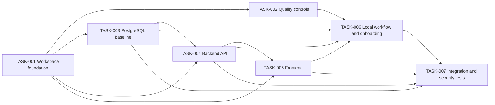

# Implementation Plan

## 1. Metadata

- Project Name: Sports_Paradise
- Project Mode: NEW_PROJECT
- Project Root: `Sports_Paradise`
- Requirements Baseline: SP-1, Application Foundation; `docs/sdlc/requirements.md`; approved; baseline commit `9c3a552`
- Architecture Baseline: Version 1.1; `docs/sdlc/architecture.md`; `DESIGN_REVIEW_APPROVED`; approval-state update commit `d6a96e9`
- Design Review Baseline: Review Cycle 1; `docs/sdlc/design-review.md`; `DESIGN_REVIEW_APPROVED`; committed in `3cb993e`
- Requirements Status: APPROVED
- Architecture Status: DESIGN_REVIEW_APPROVED
- Design Review Status: DESIGN_REVIEW_APPROVED
- Git Baseline: Branch `copilot/phase1`; HEAD `d6a96e9d9dd6784e0d5cf6351117b3ed08f83b70`; two unrelated untracked agent-profile files were present and are outside this plan.
- Planning Version: 1.0
- Implementation Plan Status: READY_FOR_IMPLEMENTATION
- Implementation Plan Approval: APPROVED

## 2. Planning Objective

Plan the approved Sports_Paradise application foundation as a greenfield web
project: a typed browser frontend, backend API, persistent PostgreSQL storage,
shared development quality controls, and a repeatable local contributor
environment. The plan translates approved requirements and architecture into
reviewable implementation increments; it does not implement code or introduce
domain features, production deployment, or permissions not present in the
approved baseline.

## 3. Implementation Scope

In scope:

- Establish the repository workspace and selected TypeScript stack.
- Add repeatable formatting, linting, type-checking, and automated-test
  conventions.
- Provision PostgreSQL locally and establish schema and migration conventions.
- Implement a backend API foundation with validated configuration, visible
  failures, a health/readiness interface, and an OpenAPI contract.
- Implement a browser-based React frontend foundation that uses the API
  boundary and contains no product-specific workflows.
- Provide local startup, shutdown, diagnostics, and contributor onboarding.
- Test the application boundaries, configuration/security defaults, and
  repeatable local setup.

Out of scope:

- Sports-domain booking, commerce, content, or other feature workflows.
- Authentication-provider selection or detailed authorization/role policy.
- Production hosting, infrastructure, CI/CD, production operations, and
  service-level targets.
- Native or mobile application delivery.
- Domain data models, retention rules, or audit workflows not defined by SP-1.

## 4. Planning Inputs

- Approved requirements: [`requirements.md`](./requirements.md), SP-1,
  Application Foundation.
- Approved architecture: [`architecture.md`](./architecture.md), version 1.1,
  with selected React/TypeScript/Vite, Node.js/TypeScript/Fastify, PostgreSQL,
  and Docker Compose stack.
- Approved design review: [`design-review.md`](./design-review.md), Review
  Cycle 1, with no findings and no remediation handoff.
- Repository inspection: `Sports_Paradise` contains only `docs/sdlc/`
  governance artifacts. No application modules, manifests, tests, migrations,
  or deployment configuration exist. This is a NEW_PROJECT plan.

## 5. Delivery Strategy

First create the repository and shared TypeScript workspace baseline. In the
next wave, implement independent coding-quality controls and PostgreSQL/local
data conventions. Then build the backend API and its contract, followed by the
frontend that consumes that boundary. Once the components exist, wire the
repeatable local startup and onboarding workflow, and finish with
cross-component, security/configuration, and regression testing.

Component-level tests are part of their implementation tasks; the final
integration task verifies the assembled local foundation. Package manager,
exact test runner, database access/migration library, and exact repository
workspace tooling remain implementation-level selections within the approved
stack and architecture constraints; do not add an unapproved framework or
production dependency.

## 6. Execution Waves

### WAVE-1 — Repository Foundation

- TASK-001

### WAVE-2 — Quality and Persistence Baselines

- TASK-002
- TASK-003

TASK-002 and TASK-003 can proceed in parallel after TASK-001.

### WAVE-3 — Backend API

- TASK-004

### WAVE-4 — Web Frontend

- TASK-005

### WAVE-5 — Local Developer Workflow

- TASK-006

### WAVE-6 — Cross-Component Verification

- TASK-007

## 7. Dependency Graph

## 8. Critical Dependency Chain

The main blocking chain for delivery of the complete local foundation is:

`TASK-001 → TASK-003 → TASK-004 → TASK-005 → TASK-006 → TASK-007`

TASK-002 is an additional prerequisite for local onboarding and can be
implemented in parallel with TASK-003.

## 9. Implementation Tasks

### TASK-001 — Establish repository workspace and TypeScript foundation

- **Task ID:** TASK-001
- **Title:** Establish repository workspace and TypeScript foundation
- **Objective:** Create the greenfield repository/package structure and shared
  TypeScript/build configuration required by the selected web and API stack.
- **Requirements:** FR-001, FR-002, FR-004; NFR-MNT-001, NFR-COMP-001; AC-001,
  AC-002, AC-004.
- **Architecture References:** CMP-001, CMP-002, CMP-005; AD-001, AD-002,
  AD-005; Sections 6, 8, 9.
- **Design Review References:** None.
- **Priority:** P0
- **Execution Wave:** WAVE-1
- **Dependencies:** None
- **Blocks:** TASK-002, TASK-003, TASK-004, TASK-005
- **Parallel With:** None
- **Status:** COMPLETE
- **Verification Result:** PASS
- **Implementation Evidence:** `docs/sdlc/implementation-log.md#task-001`
- **Implementation Scope:** Initialize the single-repository workspace for the
  approved TypeScript frontend/backend stack. Select a package manager and
  workspace mechanism consistent with Node.js/TypeScript; configure common
  build/type-check entry points and separate frontend, backend, and shared
  contract areas. Do not implement product workflows.
- **Expected Files / Areas:**
  - Confirmed existing paths: `Sports_Paradise/docs/sdlc/` governance
    documents only.
  - Anticipated new areas: repository/package manifests and workspace
    configuration; shared TypeScript compiler configuration; frontend,
    backend, and shared-contract package directories; root development
    scripts.
- **Implementation Constraints:** Preserve the approved React/Vite and
  Node.js/Fastify stack; keep frontend, backend, and data concerns separate;
  do not introduce a mobile client or production deployment configuration.
- **Testing Required:** Unit/smoke validation of workspace package discovery,
  build script execution, and TypeScript configuration; verify frontend
  bundles do not receive backend-only configuration.
- **Completion Criteria:** Frontend, backend, and shared contract areas can be
  independently addressed from the workspace; common scripts execute
  successfully; baseline type/build checks pass; package/framework choices
  conform to AD-001.
- **Evidence Expected:** Workspace manifests and configuration diff; successful
  package discovery, type-check, and minimal build output.
- **Risks / Notes:** Avoid coupling package layout to future, unspecified
  domain modules. Do not select an alternate framework under the guise of
  workspace tooling.

### TASK-002 — Establish coding standards and automated quality controls

- **Task ID:** TASK-002
- **Title:** Establish coding standards and automated quality controls
- **Objective:** Define and enforce the shared implementation, validation, and
  review-readiness conventions before feature development scales.
- **Requirements:** FR-004; BR-002; NFR-MNT-001; AC-004.
- **Architecture References:** CMP-005; AD-005; Sections 8, 9.
- **Design Review References:** None.
- **Priority:** P0
- **Execution Wave:** WAVE-2
- **Dependencies:** TASK-001
- **Blocks:** TASK-006
- **Parallel With:** TASK-003
- **Status:** COMPLETE
- **Verification Result:** PASS
- **Implementation Evidence:** `docs/sdlc/implementation-log.md#task-002`
- **Implementation Scope:** Document code structure, formatting, linting,
  type-safety, validation, test, and review conventions. Configure the
  architecture-recommended ESLint/Prettier and TypeScript checks and select a
  compatible test runner. Expose repeatable workspace commands; do not add
  CI/CD, which is outside scope.
- **Expected Files / Areas:**
  - Confirmed existing paths: `Sports_Paradise/docs/sdlc/` only.
  - Anticipated new areas: contributor coding-standard documentation; lint,
    format, test, and type-check configuration; shared package scripts and
    minimal test examples.
- **Implementation Constraints:** Use tools compatible with the confirmed
  stack. Exact test runner and versions are implementation choices; document
  them and avoid undocumented per-package alternatives.
- **Testing Required:** Run formatter check, lint, type checking, and test
  runner against the workspace baseline; include a minimal passing test and
  verify scripts fail with a non-zero result when a check fails.
- **Completion Criteria:** A contributor can find and run documented quality
  commands; frontend and backend are covered by applicable shared checks;
  standards and expected review evidence are documented.
- **Evidence Expected:** Coding convention documentation, tool configurations,
  and captured successful quality-command results.
- **Risks / Notes:** Keep checks proportional to a foundation; do not add
  application rules or unsupported security claims.

### TASK-003 — Establish PostgreSQL persistence and schema conventions

- **Task ID:** TASK-003
- **Title:** Establish PostgreSQL persistence and schema conventions
- **Objective:** Provide the persistent data-store foundation and documented
  schema-evolution conventions for future application data.
- **Requirements:** FR-003, FR-005; BR-001, BR-003; NFR-REL-001, NFR-SEC-001;
  AC-003.
- **Architecture References:** CMP-003, CMP-004; AD-001, AD-002, AD-004;
  Sections 9, 11, 14, 18, 19, 21.
- **Design Review References:** None.
- **Priority:** P0
- **Execution Wave:** WAVE-2
- **Dependencies:** TASK-001
- **Blocks:** TASK-004, TASK-006, TASK-007
- **Parallel With:** TASK-002
- **Status:** COMPLETE
- **Verification Result:** PASS
- **Implementation Evidence:** `docs/sdlc/implementation-log.md#task-003`
- **Implementation Scope:** Provision PostgreSQL for local use through the
  approved Docker Compose approach; define connection configuration, data
  ownership, schema/migration naming and review conventions, and local
  persistence lifecycle. Choose a compatible database access and migration
  tool within the approved stack. Do not invent domain entities or production
  data policies.
- **Expected Files / Areas:**
  - Confirmed existing paths: `Sports_Paradise/docs/sdlc/` only.
  - Anticipated new areas: local Compose database configuration; backend data
    access and migration configuration; placeholder-only environment
    template; ignored local secret configuration; documentation for schema
    conventions and local database lifecycle.
- **Implementation Constraints:** PostgreSQL is the selected store; only the
  backend may access it. Never commit credentials. Do not expose database
  credentials to the browser or expose database service beyond the local
  development need. No domain schema is justified by SP-1.
- **Testing Required:** Validate Compose configuration and database startup;
  verify backend-scoped connection can connect and report unavailable database
  explicitly; validate migration tooling/configuration using only a
  non-domain baseline or tool-level check; test that secret-bearing local
  config is ignored and templates contain no real secrets.
- **Completion Criteria:** PostgreSQL starts reproducibly for local
  development; storage and schema conventions are documented; configuration
  has no committed secret; database access remains backend-only.
- **Evidence Expected:** Compose/database configuration diff, migration/schema
  convention documentation, successful database readiness/connectivity check,
  and secret-ignore validation.
- **Risks / Notes:** Contributors need a compatible local container runtime.
  Document prerequisites and the approved local alternative without changing
  the persistence architecture.

### TASK-004 — Implement the backend API foundation

- **Task ID:** TASK-004
- **Title:** Implement the backend API foundation
- **Objective:** Provide a typed Fastify service boundary with explicit
  configuration, request validation, health/readiness behavior, and a
  documented contract for the frontend.
- **Requirements:** FR-002, FR-003; BR-001; NFR-MNT-001, NFR-REL-001,
  NFR-SEC-001, NFR-COMP-001; AC-002.
- **Architecture References:** CMP-002, CMP-003; AD-001, AD-002, AD-003;
  Sections 9, 12, 13, 14, 15, 17, 19.
- **Design Review References:** None.
- **Priority:** P0
- **Execution Wave:** WAVE-3
- **Dependencies:** TASK-001, TASK-003
- **Blocks:** TASK-005, TASK-006, TASK-007
- **Parallel With:** None
- **Status:** COMPLETE
- **Verification Result:** PASS
- **Implementation Evidence:** `docs/sdlc/implementation-log.md#task-004`
- **Implementation Scope:** Implement the Fastify application entry point,
  environment configuration parsing, required-setting validation, structured
  HTTP error mapping, request schema validation, database connectivity, and
  health/readiness endpoint. Describe the initial API interface with OpenAPI
  3.x. Provide automated unit/component tests. No domain endpoints,
  authentication provider, or assumed administrator permissions.
- **Expected Files / Areas:**
  - Confirmed existing paths: `Sports_Paradise/docs/sdlc/` only.
  - Anticipated new areas: backend application/bootstrap, configuration,
    route/health, error/validation, persistence adapter, OpenAPI contract, and
    backend unit/component tests.
- **Implementation Constraints:** Fastify and TypeScript per AD-001. Backend
  owns application logic and is the only application-level database client.
  Missing required configuration or unavailable required dependencies must
  fail visibly and actionably; errors and logs must not disclose secrets.
- **Testing Required:** Unit tests for configuration validation, invalid
  requests, error mapping, and health/readiness; component tests for database
  dependency success/failure and API contract shape; security checks for
  secret redaction and server-side validation.
- **Completion Criteria:** API starts only with valid required configuration;
  readiness distinguishes unavailable database from healthy service;
  OpenAPI describes the implemented foundation endpoints; no silent in-memory
  or success-shaped fallback exists; tests pass.
- **Evidence Expected:** API source and OpenAPI diff; passing backend tests;
  sample healthy and dependency-failure responses/logs with secrets omitted.
- **Risks / Notes:** SP-1 does not specify production authentication or
  authorization; do not imply that the foundation API is approved for
  protected production use. ARISK-002 remains for future feature requirements.

### TASK-005 — Implement the browser frontend foundation

- **Task ID:** TASK-005
- **Title:** Implement the browser frontend foundation
- **Objective:** Provide a React/TypeScript/Vite browser application shell and
  explicit integration with the backend contract, without adding
  sports-domain workflows.
- **Requirements:** FR-001, FR-002; BR-001, BR-004; NFR-MNT-001, NFR-SEC-001;
  AC-001.
- **Architecture References:** CMP-001, CMP-002; AD-001, AD-002, AD-003;
  Sections 7, 8, 9, 12, 13, 14.
- **Design Review References:** None.
- **Priority:** P1
- **Execution Wave:** WAVE-4
- **Dependencies:** TASK-001, TASK-004
- **Blocks:** TASK-006, TASK-007
- **Parallel With:** None
- **Status:** COMPLETE
- **Verification Result:** PASS
- **Implementation Evidence:** `docs/sdlc/implementation-log.md#task-005`
- **Implementation Scope:** Create a minimal web-only screen foundation,
  frontend structure, and API client boundary compatible with the backend
  OpenAPI contract. Surface service unavailable/error state rather than
  presenting a failed request as success. Do not add product branding,
  booking/content/commerce flows, native clients, or client-side credentials.
- **Expected Files / Areas:**
  - Confirmed existing paths: `Sports_Paradise/docs/sdlc/` only.
  - Anticipated new areas: React application entry point and screen shell,
    API client/configuration, frontend styles/assets as needed, and frontend
    component/unit tests.
- **Implementation Constraints:** React, TypeScript, and Vite per AD-001.
  Browser code must not contain database credentials, server secrets, or
  trusted authorization decisions. Use only web delivery.
- **Testing Required:** Unit/component tests for rendering, API client
  behavior, loading and dependency-failure states; type and build checks;
  contract compatibility checks against the backend's documented interface.
- **Completion Criteria:** A browser can load the frontend shell; its API
  integration targets configuration rather than hard-coded secrets; request
  failure is visible; frontend checks pass and no native or feature-specific
  behavior is added.
- **Evidence Expected:** Frontend source and test diff; successful production
  build; component/API-client test output and contract compatibility result.
- **Risks / Notes:** Keep the UI a foundation only; detailed end-user and
  administrator workflows require separate approved requirements.

### TASK-006 — Wire repeatable local startup and contributor onboarding

- **Task ID:** TASK-006
- **Title:** Wire repeatable local startup and contributor onboarding
- **Objective:** Enable contributors to configure, start, inspect, and stop the
  frontend, backend, and database consistently using documented local steps.
- **Requirements:** FR-005; BR-003; NFR-REL-001, NFR-SEC-001; AC-005.
- **Architecture References:** CMP-001, CMP-002, CMP-003, CMP-004, CMP-005;
  AD-001, AD-004, AD-005; Sections 9, 15, 17, 18, 19.
- **Design Review References:** None.
- **Priority:** P0
- **Execution Wave:** WAVE-5
- **Dependencies:** TASK-002, TASK-003, TASK-004, TASK-005
- **Blocks:** TASK-007
- **Parallel With:** None
- **Status:** COMPLETE
- **Verification Result:** PASS
- **Implementation Evidence:** `docs/sdlc/implementation-log.md#task-006`
- **Implementation Scope:** Add documented local commands to provision the
  database, run frontend and backend development processes, wait for readiness
  where needed, and shut down cleanly. Document prerequisites, configuration
  setup, troubleshooting missing configuration/container/runtime issues,
  health/readiness diagnostics, and secret-safe operation.
- **Expected Files / Areas:**
  - Confirmed existing paths: `Sports_Paradise/docs/sdlc/` only.
  - Anticipated new areas: root development scripts and Compose usage;
    contributor setup/development documentation; environment template and
    local configuration guidance; operational troubleshooting and
    health-check instructions.
- **Implementation Constraints:** Local development only. Preserve the
  frontend/backend/data separation, keep secrets outside tracked source, and
  report missing prerequisites or configuration explicitly. Do not add
  production deployment, hosting, or CI/CD.
- **Testing Required:** Execute documented setup from a clean local
  configuration; verify missing prerequisites/configuration give actionable
  failures; verify startup/readiness and shutdown behavior; confirm no
  secret-bearing files are tracked.
- **Completion Criteria:** A contributor can follow the documented steps with
  only documented prerequisites and minimal manual intervention to run and
  iterate on the application; startup failures identify the action needed;
  local services can be stopped and restarted consistently.
- **Evidence Expected:** Setup documentation and scripts diff; successful
  clean-start smoke-test transcript; documented failure-diagnostic examples;
  tracked-file secret scan result.
- **Risks / Notes:** Docker availability differs by contributor environment.
  Document the compatible-container prerequisite and supported local
  alternative without implying a production topology.

### TASK-007 — Verify integrated foundation, security defaults, and regression

- **Task ID:** TASK-007
- **Title:** Verify integrated foundation, security defaults, and regression
- **Objective:** Test the assembled frontend/API/database/local-environment
  path and demonstrate the approved foundation acceptance criteria and
  failure-handling controls.
- **Requirements:** FR-001, FR-002, FR-003, FR-004, FR-005; BR-001, BR-002,
  BR-003, BR-004; NFR-MNT-001, NFR-REL-001, NFR-SEC-001, NFR-COMP-001;
  AC-001 through AC-005.
- **Architecture References:** CMP-001 through CMP-005; AD-001 through AD-005;
  Sections 7, 9, 11-19, 23.
- **Design Review References:** None.
- **Priority:** P1
- **Execution Wave:** WAVE-6
- **Dependencies:** TASK-003, TASK-004, TASK-005, TASK-006
- **Blocks:** None
- **Parallel With:** None
- **Status:** COMPLETE
- **Verification Result:** PASS
- **Implementation Evidence:** `docs/sdlc/implementation-log.md#task-007`
- **Implementation Scope:** Add and run cross-component integration and
  local-startup smoke tests. Verify frontend-to-API contract behavior,
  backend-to-database connectivity, unavailable dependency and missing
  configuration failures, secret-safe errors/logs, and documented
  contributor-path reproducibility. Add regression coverage for the
  foundation's failure and health/readiness behavior; do not add domain
  feature tests.
- **Expected Files / Areas:**
  - Confirmed existing paths: `Sports_Paradise/docs/sdlc/` only.
  - Anticipated new areas: cross-package integration/component test suites,
    local development smoke-test scripts or instructions, and test evidence
    associated with the workspace's selected test runner.
- **Implementation Constraints:** Test only approved foundation interfaces
  and controls. Use synthetic data and non-secret test configuration.
  Security checks must not imply authentication or domain authorization
  behavior that SP-1 does not define.
- **Testing Required:** Integration, component, security/configuration,
  regression, and end-to-end local-startup smoke tests. Cover normal
  readiness, invalid/missing configuration, unavailable database, malformed
  API input, frontend API failure, and absence of secrets in committed
  configuration/logs.
- **Completion Criteria:** All approved acceptance criteria have an
  objectively verifiable test or setup/documentation result; all required
  foundation quality commands and integrated tests pass; failure paths are
  actionable and do not report false success; no production or domain scope
  has been introduced.
- **Evidence Expected:** Passing integrated test output; smoke-test result
  from documented setup; contract validation; secret/configuration checks;
  traceable test mapping to AC-001 through AC-005.
- **Risks / Notes:** This is implementation-level verification, not final
  Step 7 verification. ARISK-002 remains deferred to future product
  requirements and is not to be silently implemented here.

## 10. Blocked Tasks

| Task | Blocked By | Reason |
|------|------------|--------|
| None | None | No unresolved external prerequisites or planning blockers. Normal task dependencies are listed per task. |

## 11. Parallelizable Work

- After TASK-001, TASK-002 (quality controls) and TASK-003 (persistence/local
  database baseline) can proceed in parallel.
- The remaining tasks are ordered by the API contract, local integration, and
  end-to-end evidence dependencies; no additional parallel execution is
  assumed.

## 12. Requirements Traceability Matrix

| Requirement | Tasks |
|-------------|-------|
| FR-001 | TASK-001, TASK-005, TASK-007 |
| FR-002 | TASK-001, TASK-004, TASK-005, TASK-007 |
| FR-003 | TASK-003, TASK-004, TASK-007 |
| FR-004 | TASK-001, TASK-002, TASK-007 |
| FR-005 | TASK-003, TASK-004, TASK-006, TASK-007 |
| BR-001 | TASK-003, TASK-004, TASK-005, TASK-007 |
| BR-002 | TASK-002, TASK-007 |
| BR-003 | TASK-003, TASK-006, TASK-007 |
| BR-004 | TASK-005, TASK-007 |
| NFR-MNT-001 | TASK-001, TASK-002, TASK-004, TASK-005, TASK-007 |
| NFR-REL-001 | TASK-003, TASK-004, TASK-006, TASK-007 |
| NFR-SEC-001 | TASK-003, TASK-004, TASK-005, TASK-006, TASK-007 |
| NFR-COMP-001 | TASK-001, TASK-002, TASK-004, TASK-005, TASK-007 |
| Data Requirements | TASK-003, TASK-004 |
| Integration Requirements | TASK-004, TASK-005, TASK-007 |
| Error and Edge-Case Behavior | TASK-003, TASK-004, TASK-006, TASK-007 |
| AC-001 | TASK-001, TASK-005, TASK-007 |
| AC-002 | TASK-001, TASK-004, TASK-007 |
| AC-003 | TASK-003, TASK-007 |
| AC-004 | TASK-001, TASK-002, TASK-007 |
| AC-005 | TASK-003, TASK-006, TASK-007 |

## 13. Architecture Traceability Matrix

| Component / Decision | Tasks |
|----------------------|-------|
| CMP-001 — Web Frontend | TASK-001, TASK-005, TASK-006, TASK-007 |
| CMP-002 — Backend Application and API | TASK-001, TASK-004, TASK-006, TASK-007 |
| CMP-003 — Persistence | TASK-003, TASK-004, TASK-006, TASK-007 |
| CMP-004 — Local Development Environment | TASK-003, TASK-006, TASK-007 |
| CMP-005 — Engineering Quality Controls | TASK-001, TASK-002, TASK-006, TASK-007 |
| AD-001 — Typed TypeScript web stack | TASK-001, TASK-003, TASK-004, TASK-005, TASK-006 |
| AD-002 — Separate frontend, backend, persistence | TASK-003, TASK-004, TASK-005, TASK-007 |
| AD-003 — HTTP/JSON and OpenAPI contract | TASK-004, TASK-005, TASK-007 |
| AD-004 — PostgreSQL and reproducible local persistence | TASK-003, TASK-006, TASK-007 |
| AD-005 — Shared automated quality controls | TASK-001, TASK-002, TASK-006, TASK-007 |

## 14. Design Review Traceability

| DR Finding | Resolution / Constraint | Tasks |
|------------|-------------------------|-------|
| None identified in Review Cycle 1 | No finding remediation is required. Preserve approved scope: local development only; do not invent domain workflows, detailed permissions, or production deployment. | TASK-003, TASK-004, TASK-005, TASK-006 |
| ARISK-002 (architecture risk; not a DR finding) | Future domain data classification, authentication, authorization, retention, and audit needs require approved future requirements. Do not silently implement them as part of this foundation. | TASK-004, TASK-005, TASK-007 |

## 15. Testing Strategy

- TASK-001 and TASK-002 establish repeatable type, lint, format, build, and
  unit-test checks.
- TASK-003 tests local PostgreSQL provisioning, configuration boundaries,
  connectivity, and secret handling.
- TASK-004 tests API configuration and validation, contract shape,
  health/readiness, dependency errors, and secret-safe logging.
- TASK-005 tests frontend rendering, API client behavior, contract
  compatibility, and dependency failures.
- TASK-006 verifies documented clean setup, local readiness, actionable
  prerequisite/configuration errors, and shutdown.
- TASK-007 supplies cross-component integration, security/configuration,
  regression, and end-to-end local-startup coverage against AC-001 through
  AC-005.

Use synthetic test data. Tests must cover both healthy and failure paths and
must not claim production deployment readiness.

## 16. Security Implementation Obligations

| Obligation | Requirements / Architecture | Tasks |
|------------|-----------------------------|-------|
| Keep secrets and credentials out of source control, browser bundles, and logs; use placeholder templates and ignored local secrets. | NFR-SEC-001; Data Requirements; Sections 14, 19 | TASK-003, TASK-004, TASK-005, TASK-006, TASK-007 |
| Fail visibly and actionably when required configuration is absent or dependencies are unavailable; never silently substitute in-memory or success-shaped behavior. | NFR-REL-001, NFR-SEC-001; Error and Edge-Case Behavior; Sections 13, 15, 19 | TASK-003, TASK-004, TASK-006, TASK-007 |
| Validate requests server-side and keep database access backend-only. | FR-002, BR-001; AD-002, AD-003; Section 14 | TASK-004, TASK-005, TASK-007 |
| Use least-privilege database connectivity and keep the database private to local application services. | FR-003, NFR-SEC-001; CMP-003; Section 14 | TASK-003, TASK-004, TASK-006 |
| Do not infer user authentication or administrator authorization policy without approved requirements. | Approved scope; ARISK-002 | TASK-004, TASK-005, TASK-007 |

## 17. Data and Migration Plan

- Establish PostgreSQL local provisioning, backend-only access, connection
  configuration, and schema/migration conventions in TASK-003.
- Connect the backend and validate readiness in TASK-004; related future
  writes must follow database transaction boundaries.
- This is greenfield: no data backfill, legacy migration, compatibility
  rollout, or rollback sequence is required by the approved baseline.
- Do not create domain tables or retention behavior without approved domain
  requirements.
- Validate local persistence and failure behavior in TASK-007.

## 18. Integration Implementation Plan

- TASK-004 defines the backend HTTP/JSON interface and OpenAPI 3.x contract;
  frontend integration uses this boundary in TASK-005.
- TASK-004 owns database integration. The frontend never connects directly to
  PostgreSQL.
- No external runtime integration is required by SP-1. Future integrations
  must use environment/configuration management and must not hard-code
  credentials.
- Test contract shape, malformed requests, database unavailability, and
  frontend-visible API failures in TASK-004, TASK-005, and TASK-007.

## 19. Observability Plan

- TASK-004 provides clear backend startup errors and health/readiness behavior
  that distinguishes API availability from database readiness.
- TASK-006 documents local service status, prerequisites, startup diagnostics,
  and shutdown.
- TASK-007 checks healthy and failed dependency paths and verifies that logs
  do not expose secrets.
- Metrics, distributed tracing, production alerting, and audit infrastructure
  are not required by SP-1 and remain outside this plan.

## 20. Documentation Updates

- TASK-002: coding conventions, code structure, validation, testing, and
  review-readiness expectations.
- TASK-003: database configuration, schema/migration conventions, local
  persistence lifecycle, and secret template expectations.
- TASK-004: API/OpenAPI contract and health/readiness behavior.
- TASK-006: contributor prerequisites, setup/configuration, local startup and
  shutdown, troubleshooting, and diagnostics.
- TASK-007: record test commands/evidence and trace results to acceptance
  criteria; do not claim production readiness.

## 21. Deferred Risks and Constraints

- **ARISK-002 — Product data and access-control needs are unspecified.**
  Future feature requirements must define domain data, data classification,
  authentication, authorization, retention, and audit controls before
  implementing affected workflows. This risk is accepted for the foundation
  scope and is not a task to solve speculatively; preserve the constraint in
  TASK-004, TASK-005, and TASK-007.
- ARISK-001, stack conflict, is resolved by the stakeholder confirmation
  recorded under AQ-001; the AD-001 selected stack is the implementation
  baseline.
- No design-review findings were deferred. Production deployment remains
  outside the approved scope.
- No unresolved implementation-planning constraints block task execution.

## 22. Planning Questions

None.

## 23. Requirements Changes Required

None.

## 24. Architecture Changes Required

None.

## 25. Planning Quality Gate

- Governance: requirements are APPROVED; architecture and design review are
  DESIGN_REVIEW_APPROVED; approval states agree.
- Requirements coverage: every material FR, BR, NFR, data/integration/error
  requirement, and AC maps to one or more tasks.
- Architecture coverage: every component CMP-001 through CMP-005 and decision
  AD-001 through AD-005 maps to implementation work.
- Design-review preservation: no findings require remediation; scope
  constraints and ARISK-002 are carried into applicable tasks.
- Dependency integrity: every dependency references a defined task; no
  circular dependencies; blocking relationships match dependencies; waves
  respect ordering.
- Task quality: each task defines objective, scope, traceability, priority,
  dependencies, completion criteria, testing, and expected evidence.
- Security: configuration/secrets, input validation, database boundaries, and
  unspecified authentication/authorization are addressed in implementation
  tasks.
- Testing: unit/component, integration, contract, security/configuration,
  regression, and local end-to-end smoke tests are planned.
- Data: PostgreSQL, schema/migration conventions, ownership, local setup, and
  greenfield migration applicability are addressed.
- Integration: frontend/API contract and backend/database boundaries are
  explicitly sequenced and tested.
- Observability: local actionable startup/readiness diagnostics and
  secret-safe logs are planned.
- Documentation: standards, setup, configuration, API contract, and
  troubleshooting documentation are assigned.
- Gaps: no requirements change, architecture change, or planning question
  remains.
- Result: PASS — READY_FOR_IMPLEMENTATION.

## 26. Implementation Readiness

- Total Tasks: 7
- P0 Tasks: 5
- P1 Tasks: 2
- Number of Execution Waves: 6
- Blocked Tasks: 0 (no unresolved external blockers; normal dependencies
  remain)
- Unresolved External Blockers: 0
- Requirements Coverage: Complete; all material approved requirements and
  acceptance criteria are mapped.
- Architecture Coverage: Complete; all current-scope components and decisions
  map to tasks.
- Security Coverage: Complete for approved foundation scope; future
  authentication/authorization and domain-data controls remain constrained by
  ARISK-002 and require future approved requirements.
- Test Coverage Planning: Complete; tests are included per component and a
  dedicated cross-component verification task is defined.
- Final Status: READY_FOR_IMPLEMENTATION
